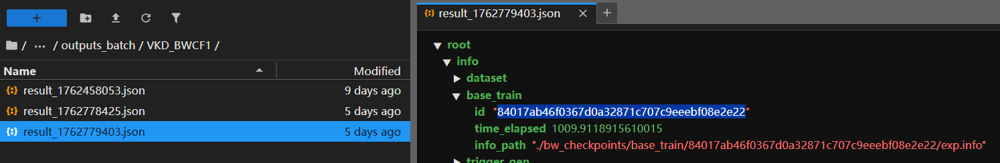
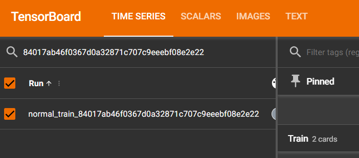

# 8ackW3ak
Official implementation of our paper.


## Datasets Adopted

* CIFAR-10: https://www.cs.toronto.edu/~kriz/cifar.html  
* CINIC-10: https://github.com/BayesWatch/cinic-10?tab=readme-ov-file#download  
  * Label mapping (lexicographical order): `airplane` -> `0`, `automobile` -> `1`, `bird` -> `2`, `cat` -> `3`, `deer` -> `4`, `dog` -> `5`, `frog` -> `6`, `horse` -> `7`, `ship` -> `8`, `truck` -> `9`
* ImageNet subset with 50 classes: https://huggingface.co/datasets/SomeBottle/imagenet_50_224x224 
<!--* Balanced GTSRB: https://huggingface.co/datasets/SomeBottle/GTSRB_224x224_balanced -->


## Environment

All our experiments were conducted on a single RTX 4090 GPU, within a Docker container. The image we used is provided below:  

* [Docker Hub](https://hub.docker.com/r/somebottle/jupyter-torch)  
* [Github Gist](https://gist.github.com/SomeBottle/8a75d490d2616ecfe100e676564ac769) ◄ Dockerfile and some tips.

Alternatively, you can install the dependencies in your own Python environment with:  

```bash
pip install -r requirements.txt
```

## Try It Out

In this section, we provide a quick guide to run some example experiments using our Docker image.

<details>

<summary><b>LINK START</b> ( •̀ ω •́ )✧ </summary>

### 1. Prepare the Environment

First, install Docker with [GPU support](https://docs.docker.com/compose/how-tos/gpu-support/) toolkit, and pull the image:

```bash
docker pull somebottle/jupyter-torch:0.0.7
```

Then, start a container with your working directory mounted, ports mapped and password set:

```bash
# If shm-size is not specified, it may easily run out of shared memory when loading data batches with multiple workers. Docker only allocates 64 MiB by default.  
docker run --gpus all -d --restart=unless-stopped --shm-size=16g --env JUPYTER_PASSWORD='EL_PSY_KONGROO' -v <Your working directory>:/app  -p 9527:9527 -p 9528:6006 --name=lab-jupyter somebottle/jupyter-torch:0.0.7
```

Now you can access JupyterLab in your browser at `http://<your_host>:9527` using the password you set (e.g., `EL_PSY_KONGROO` above).

### 2. Prepare Code and Datasets

Upload the code from `./src`, put it anywhere you like **in the container** (`/app` is recommended, as it is the mount we set up earlier), and download the datasets mentioned above.  

By default, the code [assumes](./src/configs/datasets.py#L7) that the datasets are placed in `./datasets`, so just put them there:  

```bash
/app
├── datasets # <-- here
│   ├── cifar-10-batches-py
│   │   ├── batches.meta
│   │   ├── data_batch_1
│   │   ├── data_batch_2
│   │   ...
│   ├── cinic_10
│   │   ├── test
│   │   ├── train
│   │   └── valid
│   └── imagenet_50_224
│       ├── train
│       └── val
├── configs
│   ├── __init__.py
│   ├── config.py
│   ├── datasets.py
│   └── module_factories.py
├── experiments
│   ├── examples
│   ...
├── run_multiple.py
├── run_single_adba.py
├── run_single_backweak.py
├── run_single_scar.py
...
```

### 3. Run Examples

Create a new terminal in the JupyterLab and just have a try:  

```bash
cd /app  # or wherever you put the code

# BackWeak
python run_single_backweak.py -c experiments/examples/VKD_BWCF.toml --od experiment_outputs/ -d cuda:0

# ADBA
python run_single_adba.py -c experiments/examples/FT_ADCF.toml --od experiment_outputs/ -d cuda:0

# OSCAR
python run_single_scar.py -c experiments/examples/RL_OSCF.toml --od experiment_outputs/ -d cuda:0
```

> You can use the `-h` option to view the help message.

### 4. View Logs and Results

You can inspect the **detailed** experiment logs via TensorBoard:   

* Start TensorBoard in the background:  

    ```bash
    screen -dmS tb tensorboard --host=0.0.0.0 --logdir=./tb_logs/
    ```
    > `./tb_logs` is the default TensorBoard logging directory specified in [`./src/configs/config.py`](./src/configs/config.py#L10). 

* Then you can access it at `http://<your_host>:9528` (the default TensorBoard port `6006` has been mapped to the host port `9528`).  

To gather the experimental results, you may go to the output directory you specified (e.g., `experiment_outputs/` in the above commands).  

> 💡 **TIPS**
> To inspect the logs of a specific component during an experiment, you may check the experiment outputs and find the corresponding `id`:  
>   
>
> Then, you can filter the logs in TensorBoard using this `id`:
> 
</details>

## Unofficial implementations

We made some unofficial implementations of the previous work. No more "[coming soon](https://archive.is/6gA9Y)", plz!   
(ಥ皿ಥ) 

### ADBA

Implemented in [`reprod_modules/adba`](./src/reprod_modules/adba/).  

* Paper: [Anti-distillation backdoor attacks: Backdoors can really survive in knowledge distillation](https://dl.acm.org/doi/pdf/10.1145/3474085.3475254)  

### SCAR

Implemented in [`reprod_modules/scar`](./src/reprod_modules/scar/).  

* Note that because this work is **computationally very expensive** and difficult to tune, this implementation is incomplete and may contain some errors. It is provided for reference only. 
* Paper: [Taught Well Learned Ill: Towards Distillation-conditional Backdoor Attack](https://arxiv.org/pdf/2509.23871)  
* (2025.11.17) Glad to see they finally released their official code: https://github.com/WhitolfChen/SCAR  

### Neural Cleanse

Implemented in [`defense_modules/neural_cleanse.py`](./src/defense_modules/neural_cleanse.py). 

* Paper: [Neural Cleanse: Identifying and Mitigating Backdoor Attacks in Neural Networks](https://bolunwang.github.io/assets/docs/backdoor-sp19.pdf)  

### SCALE-UP

Implemented in [`defense_modules/scale_up.py`](./src/defense_modules/scale_up.py).  

* We still adopt the Z-Score normalization used in [the official impl](https://github.com/THUYimingLi/BackdoorBox/blob/main/core/defenses/SCALE_UP.py), but followed the original paper's idea more closely by calculating the *mean* and *std* class-wise. Additionally, we correct potential biases regarding the calculation of statistics for benign samples.  
* Paper: [Scale-up: An efficient black-box input-level backdoor detection via analyzing scaled prediction consistency](https://arxiv.org/pdf/2302.03251)  

### STRIP

Implemented in [`defense_modules/strip.py`](./src/defense_modules/strip.py).  

* Following the [official implementation](https://github.com/garrisongys/STRIP/blob/master/STRIP_CIFAR10DeepArchit_Tb.ipynb), but in a more parallel manner.  
* Paper: [STRIP: A defence against trojan attacks on deep neural networks](https://arxiv.org/pdf/1902.06531)  

## Disclaimer

The code in this repository is provided **solely for academic research purposes**. All datasets used in this study are **publicly available** and contain no private or sensitive information. Throughout the entire research process, we **did not perform any attacks in real-world systems**, nor did we distribute any harmful model weights. The purpose of this project is to further enhance the evaluation and understanding of backdoor attack threats in knowledge distillation as part of model supply-chain security.  

The authors assume no responsibility for any consequences arising from misuse or improper application of the materials provided herein.

## Libraries Used

Credits to the diligent work of open-source developers!  

* [NiklasRosenstein/python-stablehash](https://github.com/NiklasRosenstein/python-stablehash) - [ [MIT License](./src/stablehash/LICENSE) ].  
* [richzhang/PerceptualSimilarity](https://github.com/richzhang/PerceptualSimilarity/) - [ [BSD-2-Clause License](./src/lpips/LICENSE) ].  

## License

Licensed under the MIT License. 